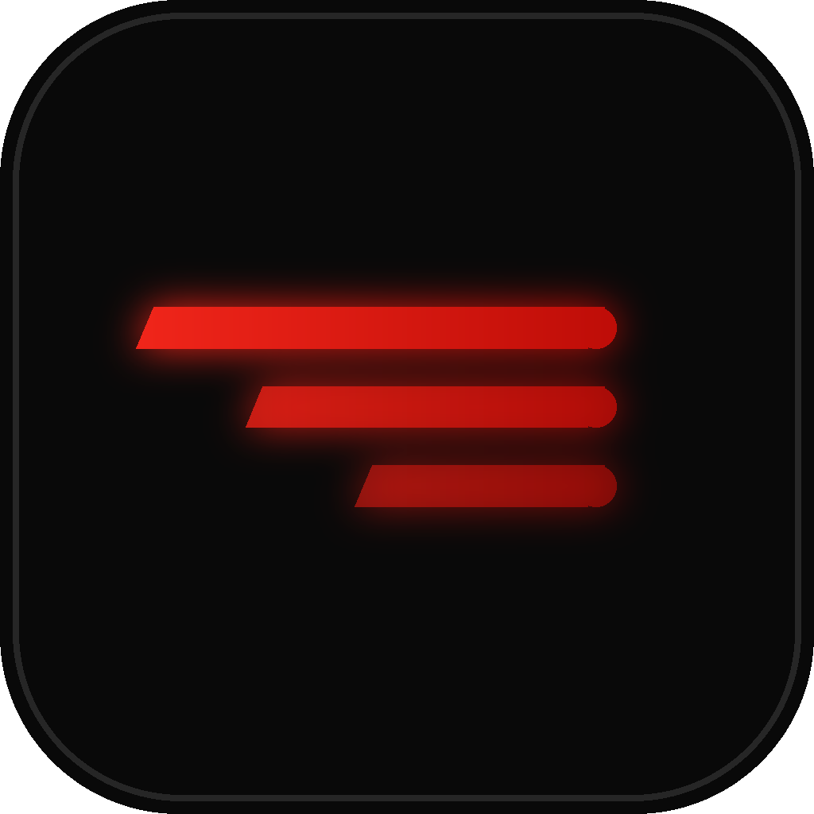
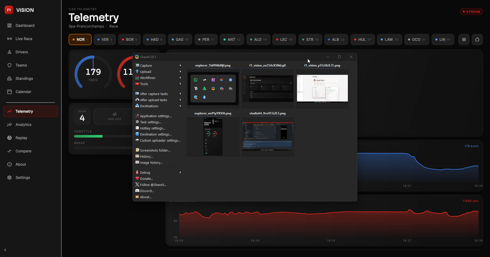
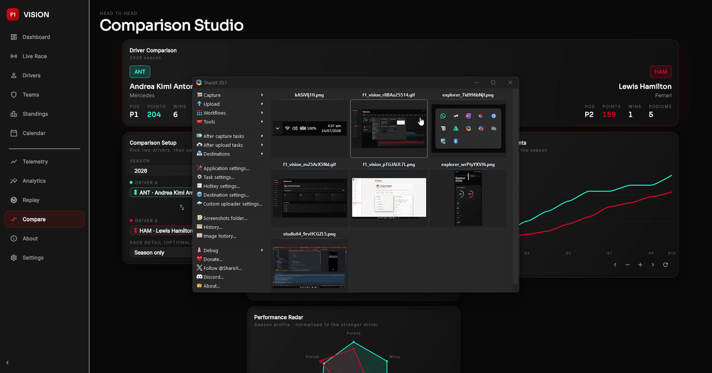

<div align="center">



# F1 Vision

### Formula 1 telemetry, analytics and race strategy — rebuilt as a consumer app.

A production-grade Flutter application that turns public Formula 1 data into the
kind of dense, real-time dashboards normally locked inside a race engineer's
garage: live timing, car telemetry, a Bloomberg-terminal-style analytics board,
a full lap-by-lap race replay engine, and head-to-head driver comparison.

[](https://flutter.dev)
[](https://dart.dev)
[](#platform-support)
[](#architecture)
[](https://pub.dev/packages/flutter_lints)
[](LICENSE)

**[Features](#features) · [Screens](#screens) · [Architecture](#architecture) · [Getting started](#getting-started) · [Roadmap](#roadmap) · [Contributing](CONTRIBUTING.md)**

<sub>An independent fan project. Not associated with, endorsed by, or affiliated with Formula 1, the FIA, or any team.</sub>

</div>

---

<div align="center">


<sub><i>Analytics Command Center — fourteen live panels, nine chart types, one screen.</i></sub>

</div>

---

## Table of contents

- [Why this exists](#why-this-exists)
- [At a glance](#at-a-glance)
- [Features](#features)
  - [Live timing](#live-timing)
  - [Telemetry dashboard](#telemetry-dashboard)
  - [Analytics Command Center](#analytics-command-center)
  - [Race Replay and Strategy Simulator](#race-replay-and-strategy-simulator)
  - [Driver Comparison Studio](#driver-comparison-studio)
  - [Accounts, theming and offline](#accounts-theming-and-offline)
- [Screens](#screens)
- [Architecture](#architecture)
- [Design system](#design-system)
- [Tech stack](#tech-stack)
- [Data sources](#data-sources)
- [Getting started](#getting-started)
- [Configuration](#configuration)
- [Platform support](#platform-support)
- [Keyboard shortcuts](#keyboard-shortcuts)
- [Performance and offline](#performance-and-offline)
- [Accessibility](#accessibility)
- [Project structure](#project-structure)
- [Roadmap](#roadmap)
- [Troubleshooting](#troubleshooting)
- [FAQ](#faq)
- [Contributing](#contributing)
- [License](#license)
- [Author](#author)
- [Acknowledgements](#acknowledgements)

---

## Why this exists

Most Formula 1 apps show you a leaderboard and a countdown. The interesting
questions live one layer deeper:

> *Did that undercut actually work, or did he lose the place in the pit lane?*
>
> *How much was the tyre falling away in the ten laps before the stop?*
>
> *Was that gap real pace, or was he stuck behind a train?*
>
> *Across a whole season, who converts qualifying pace into points most
> efficiently?*

Answering any of those means reconstructing a race lap by lap and putting pace,
position and tyre life on the same timeline. That is what strategists do on the
pit wall, and it is what F1 Vision rebuilds — as an interface you can actually
hand to someone.

The second goal is educational. This repository is meant to be a
**reference-quality Flutter codebase**: strict Clean Architecture with a
one-directional data flow, a single-source design system that makes light mode a
one-line switch, offline-first caching behind an interface the rest of the app
never sees, and a responsive layout that reflows from a three-column desktop
board to a phone without dropping information density.

Everything is built on free public APIs. There are no keys to obtain, no
scraping, and no paid tier required to run it.

---

## At a glance

| | |
|---|---|
| **Fully built screens** | 8 — Home, Live Race, Standings, Telemetry, Analytics, Replay, Comparison, Settings, About |
| **Analytics panels** | 14, on one responsive masonry board |
| **Chart types** | 9 — line, area, horizontal bar, pie, donut, radar, scatter, sparkline, progress ring |
| **Replay coverage** | Every Grand Prix with lap timing — **1996 to present** |
| **Telemetry coverage** | 2023 onward, via OpenF1 |
| **Dart source** | ~109 files, ~17,000 lines |
| **Runtime dependencies** | 14, all widely maintained |
| **Codegen** | One generated file (Isar schema) |
| **Themes** | Dark and light, persisted, with live OS following |
| **Offline** | Two-tier cache; previously-viewed screens work with no connection |

---

## Features

### Live timing

A race-control style leaderboard driven by OpenF1's session feed.

- **Rows slide between positions** using `AnimatedPositioned` rather than
  rebuilding the list, so an overtake reads as movement rather than a flicker.
- Tyre-compound pills, DRS chips, gap-to-leader and interval-to-car-ahead.
- **Session-aware presentation.** The screen detects whether a session is
  actually running. During a race you get the live feed with gaps and DRS;
  outside one it becomes *Race Result — latest classification*, a clean ordered
  list of finishing positions with no stale decorations and no pulsing "LIVE"
  badge that would be lying to you.
- **Adaptive polling** — five seconds during a live session, two minutes
  afterwards, because a final classification does not change.

### Telemetry dashboard

An engineer-style cockpit streaming OpenF1 `/car_data`.

- Animated **270° speed and RPM gauges** with redline marking.
- A status rail for gear, DRS state, throttle and brake percentages, and track
  position.
- **Three synchronised traces** — speed, engine RPM, and throttle/brake — that
  share a single crosshair and an engineer cursor read-out, so you can line up
  a braking point across all three channels at once.
- A viewport navigator with **zoom and pan**, plus follow-live mode.
- Pause, restart and driver selection.
- **Rolling-window streaming**: each poll fetches only the new time-slice and
  appends it to a capped buffer, instead of refetching the session. This is what
  keeps a continuously-updating chart from becoming a memory problem.

### Analytics Command Center

Fourteen panels over one season, laid out as a responsive masonry board.

| Panel | What it answers | Chart |
|---|---|---|
| Season Statistics | Finish rate, retirement rate, headline totals | Progress rings + metric tiles |
| Championship Progress | How the title fight developed round by round | Animated line, zoom + pan |
| Driver Rankings | Points order across the field | Horizontal bar |
| Constructor Performance | Share of constructor points | Pie |
| Team Trends | Which teams gained or lost ground | Area |
| DNFs & Reliability | Where results are actually being lost | Donut |
| Podiums | Consistency at the sharp end | Horizontal bar |
| Pole Positions | Single-lap pace | Horizontal bar |
| Fastest Laps | Race-pace peaks | Horizontal bar |
| Average Finish | Converting pace into points | Scatter |
| Average Race Pace | Mean fastest-lap speed, zoomed axis | Horizontal bar |
| Driver Form | Last five results per driver | Sparklines |
| Historical Comparison | Title contenders across six axes | Radar |
| Pit Stops | Stationary time at the latest race | Metric tiles |

Every chart supports tooltips, hover on desktop and touch on mobile, with
smooth entry animations. The championship chart adds button-driven zoom and pan.
The board auto-refreshes every 90 seconds for the current season and never polls
for completed ones.

### Race Replay and Strategy Simulator

The signature feature. Replay any Grand Prix or Sprint, lap by lap.

- **Race selection** by season, Grand Prix and session, with a header showing
  circuit, date, winner, pole sitter and fastest lap.
- **Transport controls** — play, pause, restart, previous/next lap, replay
  speeds of 0.5×, 1×, 2× and 5×, and a scrubber that jumps straight to any lap.
- **Race timeline** — a horizontal strip of safety cars, virtual safety cars,
  red and yellow flags, weather changes, fastest laps and retirements, with pit
  stops as dense tick marks. Tap any marker to jump the replay there.
- **Animated leaderboard** — rows slide between positions, with live gaps, tyre
  compounds, pit indicators and a badge showing places gained or lost versus the
  starting grid. Retired cars fade out and settle at the bottom.
- **Tyre strategy timeline** — every driver's stints as coloured blocks on a
  shared lap axis, with a playhead that stays in sync. Hovering a block reveals
  the stint window, its length, and the positions either side of the stop that
  started it.
- **Position history** with an inverted axis so P1 sits on top.
- **Lap-time analysis** with a metric switcher: lap time, sectors one through
  three, a rolling average pace, and delta to the leader.
- **Speed analysis** — top and average speed per driver plus a distribution
  histogram of the field's speed-trap readings.
- **Race feed** — a synchronised log of overtakes, pit stops, fastest laps,
  safety cars and incidents that auto-scrolls as playback advances, with each
  entry tappable to jump.

Overtakes are *derived*, not published: the repository compares consecutive lap
snapshots and discards swaps that happen within a lap of a pit stop, so strategy
undercuts are not misreported as wheel-to-wheel passes.

### Driver Comparison Studio

Any two drivers, season-wide or drilled into a single race.

- Profile overview with championship position, points, wins and podiums.
- **Season head-to-head bars** across points, wins, podiums, poles, fastest
  laps, average finish, DNFs and race pace — bars grow from the centre so the
  advantage is obvious, with the stronger side highlighted per metric.
- **Normalised six-axis radar**, scaled so 100 is the better of the two.
- **Championship progress** for both drivers on one chart.
- Race-level panels: lap-time comparison, position changes, best sector times,
  top and average speed, tyre strategy side by side, and every pit stop with its
  stationary time.
- **Pace vs tyre age scatter** — each point is one racing lap, plotted against
  how old the tyre was. This is the degradation view, and it is where a
  comparison tool earns its keep.

Lap-time panels filter out in-laps, out-laps and safety-car laps using a 107%
median cut-off, so "pace" reflects genuine racing laps rather than a distorted
average.

The whole screen performs **no network I/O of its own** — it composes the
already-cached analytics aggregate with the already-cached replay payload, which
is why swapping drivers is instant.

### Accounts, theming and offline

- **Authentication** — email/password sign-in and registration plus Google
  Sign-In, guest mode, and password reset. Entirely optional: with no Firebase
  configuration the app runs exactly as before, in no-auth mode.
- **Light and dark themes** with a Dark / Light / Auto selector. Auto follows
  the OS live. The choice persists across launches.
- **Offline-first caching.** Responses persist on device, so screens you have
  already opened still render with no connection.
- **Navigation drawer** grouping all destinations by section, with a quick theme
  switch in its footer.

---

## Screens

<div align="center">

| Analytics Command Center | Telemetry Dashboard |
| :---: | :---: |
|  |  |
| Fourteen panels, nine chart types, season selector | Animated gauges and synchronised traces |

| Comparison Studio | Mobile — adaptive layout |
| :---: | :---: |
|  |  |
| Head-to-head across a season or a single race | Drawer navigation, full density preserved |

| Light mode |
| :---: |
|  |
| Every screen, both themes |

</div>

---

## Architecture

F1 Vision follows **Clean Architecture** with a strictly one-directional data
flow. No widget touches Dio or parses JSON; no repository throws across its
boundary.

```
┌──────────┐   ┌────────────┐   ┌──────────────┐   ┌───────────┐   ┌──────────┐
│  models  │──▶│  services  │──▶│ repositories │──▶│ providers │──▶│ features │
│immutable │   │  raw HTTP  │   │ aggregation  │   │  Riverpod │   │    UI    │
│+ fromJson│   │  OpenF1 /  │   │ → Result<T>  │   │  polling  │   │  widgets │
│          │   │  Jolpica   │   │              │   │  caching  │   │   only   │
└──────────┘   └────────────┘   └──────────────┘   └───────────┘   └──────────┘
                     │                                    │
                     ▼                                    ▼
             ┌───────────────┐                   ┌──────────────────┐
             │   DioClient   │                   │    CacheStore    │
             │ retry, logging│◀──────────────────│  memory L1       │
             │  Retry-After  │                   │  → Isar L2       │
             └───────────────┘                   └──────────────────┘
```

### Layers

| Layer | Folder | Responsibility |
|---|---|---|
| Models | `lib/models/` | Immutable data classes and `fromJson` parsing |
| Services | `lib/repositories/services/` | Raw API access, one class per provider |
| Repositories | `lib/repositories/` | Compose services, aggregate, return `Result<T>` |
| Providers | `lib/providers/` | Riverpod state, polling cadence, cache decisions |
| Features | `lib/features/<name>/` | Screens and feature-local widgets only |

Shared foundations live in `lib/core/`; routing in `lib/routes/`.

### The five rules

1. **UI never calls Dio or parses JSON.** Screens watch providers, nothing else.
   This keeps them testable and free of I/O concerns.
2. **Repositories never throw across their boundary.** They return `Result<T>`
   (`Success` or `Err<Failure>`) via a `_guard` helper, so errors become data
   and every screen can render a real error state instead of a red box.
3. **No hard-coded colours or text styles.** Everything resolves through
   `AppColors` and `AppTextStyles` — precisely what makes light mode a one-line
   switch rather than a rewrite.
4. **Every screen handles loading, empty and error.** No blank frames, ever.
5. **Don't refactor completed features while adding a new one.** Keeps diffs
   reviewable and regressions traceable.

### Error model

```dart
sealed class Result<T> { }        // Success<T> | Err<T>
sealed class Failure   { }        // Network | Server | RateLimit | Unknown | Auth
sealed class AppException { }     // Network | Timeout | Server | RateLimit | Parse
```

Services throw typed `AppException`s; `mapExceptionToFailure()` converts them at
the repository boundary. The UI pattern-matches on `Result` and always has a
user-presentable message — no raw exception strings ever reach the screen.

### Key design decisions

**Immutable payloads, minimal rebuilds.** The Analytics board and the Replay
Studio each watch their provider *exactly once*. The resulting immutable object
flows down to pure widgets, and playback advances a single lap counter that
panels read via `.select()` — so a lap tick repaints the leaderboard and the
timeline, not the whole screen.

**Pluggable telemetry providers.** `ReplayEnrichmentSource` is an interface the
replay repository queries in order. OpenF1 implements it today for 2023 onward.
Adding a new provider — a paid feed, FastF1, your own scraper — means writing
one class and registering it in `core_providers.dart`. **No model, repository or
UI change is required**, and a provider with no coverage for an event simply
returns `null` so the replay falls back to timing data.

**Composition over refetching.** The Comparison Studio is a pure composition of
two existing caches. This is why it needed no repository of its own, and why
switching drivers costs nothing.

**Graceful degradation everywhere.** Firebase missing? The app runs without
auth. Isar can't open? In-memory cache. No telemetry provider for a 2005 race?
The replay works from timing data and the affected panels explain why they are
empty instead of rendering a blank frame.

---

## Design system

Every visual value has exactly one source, which is what makes theming and
consistency tractable.

**Colour** — `lib/core/theme/app_colors.dart`. Surfaces and text are
brightness-aware getters that swap between a near-black cockpit palette and a
warm paper-white one. Brand colours stay constant across themes so charts remain
readable and team identities recognisable.

| Token | Dark | Light |
|---|---|---|
| `background` | `#090909` | `#F6F5F3` |
| `surface` | `#161616` | `#FFFFFF` |
| `surfaceHigh` | `#1F1F1F` | `#EFEDEA` |
| `surfaceStroke` | `#2A2A2A` | `#E1DED8` |
| `textPrimary` | `#F5F5F5` | `#161616` |
| `accent` | `#E10600` (F1 red) | same |
| `positive` / `negative` / `warning` / `info` | constant across themes | |

Team colours resolve through `TeamPalette.of(constructorId)`, which maps known
constructors to brand hues and falls back to a deterministic HSL hue derived
from the id — so historical seasons still render distinct, stable colours.

**Type** — `AppTextStyles`, built on Sora for display and Inter for UI, with a
`numeric` style using tabular figures so timing columns don't jitter as digits
change.

**Spacing and motion** — `AppSpacing` and `AppDurations` provide a 4px rhythm,
radius scale and shared animation durations, so micro-interactions across
different screens feel like one system.

> **A gotcha worth knowing:** because surface and text colours are *getters*
> rather than constants, an expression using them cannot be `const`:
>
> ```dart
> const Icon(Icons.info, color: AppColors.textSecondary)  // ✗ won't compile
> Icon(Icons.info, color: AppColors.textSecondary)        // ✓
> ```
>
> Accent colours *are* `const` and are safe inside const expressions.

---

## Tech stack

| Concern | Choice | Why |
|---|---|---|
| Framework | **Flutter 3.27+** | One codebase across six platforms; uses `Color.withValues` |
| State | **Riverpod 2** | Compile-safe DI, families for keyed data, `select` for surgical rebuilds, `autoDispose` for timers |
| Routing | **GoRouter** | Shell route keeps nav chrome mounted; deep links and web URLs work by default |
| Networking | **Dio** | Interceptors made retry, TTL caching and `Retry-After` handling clean to implement |
| Charts | **fl_chart 0.69** | Covers line, bar, pie, radar and scatter; custom painters fill the rest |
| Persistence | **Isar** | Fast, synchronous reads — which let it slot behind the existing cache interface unchanged |
| Auth | **Firebase Auth** | Standard, free at this scale, and optional by design |
| Motion | **flutter_animate**, **shimmer** | Declarative entrances and skeletons |
| Type | **google_fonts** | Sora + Inter without bundling binaries |

Deliberately **not** used: code generation for models (hand-written `fromJson`
keeps the diff readable and the build fast), and any state solution requiring
build-time codegen beyond the Isar schema.

---

## Data sources

| Source | Provides | Coverage | Notes |
|---|---|---|---|
| [**OpenF1**](https://openf1.org) | Sessions, live positions, car telemetry, weather, race control, tyre stints, lap sectors | 2023 → present | Live in-session telemetry requires a paid account; otherwise the most recent completed session streams as a replay |
| [**Jolpica**](https://github.com/jolpica/jolpica-f1) | Standings, results, qualifying, lap timings, pit stops, schedules | 1950 → present (lap timing from 1996) | Ergast-compatible successor. `limit` caps at 100, so season and lap feeds paginate |

**No API keys are required** for any data feature.

Practical consequences worth understanding:

- A full race's lap timings paginate over individual driver-lap rows, so a race
  needs roughly a dozen requests the first time you open it. They are cached for
  six hours, because a completed race never changes.
- Season-wide feeds use server-side filters where possible — poles come from
  `/qualifying/1` rather than paging the whole qualifying table.
- Both APIs are free community projects. Be a good citizen: the caching layer
  exists partly to keep load off them, and the Dio client honours `Retry-After`
  on 429 responses.

---

## Getting started

### Prerequisites

- **Flutter 3.27+** and **Dart 3.3+** — `flutter doctor` should be clean
- A platform toolchain: Android Studio, Xcode, or Visual Studio 2022 with the
  *Desktop development with C++* workload for Windows

### Install

```bash
git clone https://github.com/ArsalanKaleem/F1-Vision.git
cd F1-Vision

# This repository ships Dart source only — generate platform folders once.
flutter create . --project-name f1_vision \
  --platforms=android,ios,web,windows,macos,linux

flutter pub get
```

### Generate the offline-cache schema — required

Isar's schema is generated code. **The project will not compile until you run
this once:**

```bash
dart run build_runner build --delete-conflicting-outputs
```

Re-run it whenever you modify an `@collection` class. Generated `*.g.dart` files
are git-ignored and should never be committed.

### Run

```bash
flutter run                  # attached device
flutter run -d chrome        # web
flutter run -d windows       # desktop
flutter run -d macos
```

### Build

```bash
flutter build apk --release --split-per-abi
flutter build appbundle --release
flutter build ipa --release
flutter build web --release --web-renderer canvaskit
flutter build windows --release
```

### Generate icons and splash

```bash
dart run flutter_launcher_icons
dart run flutter_native_splash:create
```

---

## Configuration

### Make it yours

All About-screen content — developer name, bio, social links, repository and
store URLs, and the bundled legal text — lives in a single file:

```
lib/core/constants/app_info.dart
```

Entries left blank are hidden automatically, so deleting a social link simply
removes its button rather than leaving a dead one.

### Authentication (optional)

The app runs perfectly without Firebase; Settings simply reports that sign-in
is not configured. To enable it, follow
**[docs/FIREBASE_SETUP.md](docs/FIREBASE_SETUP.md)**:

1. Create a Firebase project and enable **Email/Password** and **Google**
   sign-in methods.
2. Install the CLI and configure:
   ```bash
   dart pub global activate flutterfire_cli
   flutterfire configure
   ```
3. Add your Android **SHA-1** fingerprint — without it, Google Sign-In fails
   with `ApiException: 10`. No separate JDK needed:
   ```bash
   cd android && ./gradlew signingReport
   ```
4. For release builds, add a *second* SHA-1 from your release keystore **and**
   the one Google Play generates under Play Console → Setup → App signing.

`google-services.json`, `GoogleService-Info.plist` and `firebase_options.dart`
are git-ignored deliberately — each contributor generates their own.

---

## Platform support

| | Android | iOS | Web | Windows | macOS | Linux |
|---|:---:|:---:|:---:|:---:|:---:|:---:|
| UI, charts, routing | ✅ | ✅ | ✅ | ✅ | ✅ | ✅ |
| Live and historical data | ✅ | ✅ | ⚠️ CORS | ✅ | ✅ | ✅ |
| Offline cache (Isar) | ✅ | ✅ | ⚠️ session only | ✅ | ✅ | ✅ |
| Email/password auth | ✅ | ✅ | ✅ | ⚠️ partial | ✅ | ⚠️ partial |
| Google Sign-In | ✅ | ✅ | ✅ | ❌ | ✅ | ❌ |
| Keyboard shortcuts | — | — | ✅ | ✅ | ✅ | ✅ |
| App icon | ✅ | ✅ | ✅ | ✅ | ✅ | — |
| Native splash | ✅ | ✅ | ✅ | ❌ | ❌ | ❌ |

**Web.** `path_provider` has no web implementation, so Isar initialisation fails
and the cache falls back to memory for the session — every feature still works,
it just doesn't survive a reload. Build with CanvasKit: the glassmorphic panels
use `BackdropFilter`, which is slow and visually inconsistent under the HTML
renderer.

**Windows.** The only platform that compiles the Firebase C++ SDK from source,
which makes it the only one that can hit CMake toolchain issues — see
**[docs/WINDOWS_BUILD.md](docs/WINDOWS_BUILD.md)**. Google Sign-In has no
Windows implementation at all; consider hiding that button on desktop.

**Desktop generally.** The navigation rail, three-column boards, hover states
and keyboard shortcuts were designed for these targets rather than retrofitted.

---

## Keyboard shortcuts

Available in the **Replay Studio** on desktop and web:

| Key | Action |
|---|---|
| <kbd>Space</kbd> / <kbd>K</kbd> | Play / pause |
| <kbd>←</kbd> <kbd>→</kbd> | Previous / next lap |
| <kbd>R</kbd> | Restart from lap 1 |
| <kbd>Home</kbd> / <kbd>End</kbd> | Jump to start / chequered flag |
| <kbd>1</kbd> <kbd>2</kbd> <kbd>3</kbd> <kbd>4</kbd> | Replay speed 0.5× / 1× / 2× / 5× |

An on-screen legend sits under the transport controls, so the shortcuts are
discoverable rather than hidden.

---

## Performance and offline

**Two-tier cache.** A memory L1 sits over an Isar L2 that survives restarts.
Entries are keyed by full request URL and store the raw JSON body, which means
new endpoints cache automatically — the schema never learns about F1 models.
Because Isar's reads are synchronous, the store slots behind the existing
`CacheStore` interface without changing `DioClient`, any service, or any
repository.

**TTL by volatility.**

| Data | TTL | Rationale |
|---|---|---|
| Live session, positions, weather | 30s | Changes continuously |
| Standings, current season analytics | 30s | Changes after each race |
| Completed seasons, races, replays | 6h | Immutable — never changes |

**Bounded rebuilds.** `select()` on playback state so a lap tick doesn't
repaint the board; `RepaintBoundary` around charts; single-watch screens passing
immutable payloads down to pure widgets.

**Rolling-window streaming.** Telemetry fetches only each new time-slice and
appends to a capped 200-sample buffer rather than refetching the session.

**Pruning.** Rows older than seven days are dropped at startup. Settings →
Offline data shows the cached entry count with a manual purge.

Deeper detail in **[docs/OFFLINE_CACHE.md](docs/OFFLINE_CACHE.md)**.

---

## Accessibility

- Semantic labels on panels, comparison rows, navigation items and social
  buttons, so screen readers announce meaning rather than raw values.
- Minimum 44×44 tap targets on interactive controls.
- Active navigation state is conveyed by a marker bar and icon weight, not
  colour alone.
- The footer's beating heart honours the OS *reduce motion* setting.
- Text contrast is checked in both themes; hero imagery sits under a
  theme-aware scrim rather than relying on the artwork being dark enough.
- Every chart's data is also available as text — tooltips, metric tiles and the
  race feed — so nothing is exclusively visual.

Known gaps: chart canvases are not individually navigable by keyboard, and there
is no high-contrast theme yet. Contributions welcome.

---

## Project structure

```
lib/
├── core/                       # cross-cutting foundations
│   ├── constants/              #   API endpoints, cache TTLs, app/developer info
│   ├── data/                   #   Isar collections + offline cache store
│   ├── errors/                 #   AppException → Failure mapping
│   ├── network/                #   DioClient (retry + cache), Result<T>
│   ├── theme/                  #   AppColors, AppTextStyles, AppSpacing, TeamPalette
│   ├── utils/                  #   JSON coercion, responsive helpers, formatters
│   └── widgets/                #   GlassCard, DataPanel, skeletons, counters
├── models/                     # immutable data classes (+ fromJson)
│   ├── analytics.dart  comparison.dart  replay.dart
│   ├── driver.dart     session.dart     standings.dart   telemetry.dart
├── repositories/               # aggregation → Result<T>
│   ├── replay/                 #   pluggable telemetry-enrichment sources
│   └── services/               #   raw OpenF1 / Jolpica access
├── providers/                  # Riverpod: DI, polling, theme, auth, playback
├── features/                   # one folder per screen — UI only
│   ├── about/       analytics/   auth/       compare/    home/
│   ├── live_race/   replay/      settings/   shell/
│   ├── standings/   telemetry/
└── routes/                     # GoRouter + navigation destinations

docs/                           # setup guides and media
assets/branding/                # icons, splash, About hero artwork
```

---

## Roadmap

- [x] Live timing, standings, home dashboard
- [x] Telemetry dashboard with synchronised traces
- [x] Analytics Command Center
- [x] Race Replay & Strategy Simulator
- [x] Driver Comparison Studio
- [x] Authentication, light mode, offline caching
- [x] About screen, drawer navigation, production polish
- [ ] **Circuit Explorer** — interactive track maps, DRS zones, elevation
      profiles, speed traps
- [ ] Drivers and Teams detail pages
- [ ] Calendar with countdowns and circuit profiles
- [ ] Favourites and saved comparisons synced per account
- [ ] Widget tests for the aggregation layer
- [ ] Predictive strategy simulator — *"what if he'd pitted on lap 22?"*

---

## Troubleshooting

| Symptom | Cause and fix |
|---|---|
| `Target of URI hasn't been generated: cached_response.g.dart` | Isar codegen not run → `dart run build_runner build --delete-conflicting-outputs` |
| Windows: `Compatibility with CMake < 3.5 has been removed` | Old Firebase C++ SDK vs CMake 4 → see [docs/WINDOWS_BUILD.md](docs/WINDOWS_BUILD.md) |
| Google Sign-In fails with `ApiException: 10` | Missing SHA-1 fingerprint in Firebase console |
| App skips the login screen entirely | Firebase didn't initialise — check the debug console for the fallback log line |
| Charts blurry or janky on web | Rebuild with `--web-renderer canvaskit` |
| Replay says "no lap-by-lap timing" | Jolpica lap timing starts in 1996 — pick a later race |
| Sector, speed or compound panels are empty | That season predates OpenF1 (2023) — timing-only mode is expected |
| Analytics is slow the first time | A season paginates several requests; subsequent loads are cached |
| `429 Too Many Requests` | Upstream rate limit — the client backs off and honours `Retry-After` |

---

## FAQ

**Do I need an API key?**
No. Every data feature runs on free public endpoints with no registration.

**Does it work offline?**
Screens you have already opened do, thanks to the Isar cache. Screens you have
never visited will show their error state with a retry — there is nothing
cached to serve.

**Why does live telemetry not update during a race?**
OpenF1 gates real-time in-session telemetry behind a paid account. Without one,
the dashboard streams the most recent completed session as a replay, which is
exactly what the rolling-cursor playback was designed for.

**How far back can I replay races?**
Jolpica publishes lap-by-lap timing from **1996**. Earlier races have results
and standings but cannot be replayed; the studio detects this and says so.

**Why is authentication optional?**
Because none of the data features need it. Making it optional means the project
is useful the moment it is cloned, with no Firebase project required.

**Can I add my own data provider?**
Yes — that is what `ReplayEnrichmentSource` exists for. Implement the interface,
register it, and the UI picks it up untouched.

**Is this affiliated with Formula 1?**
No. It is an independent fan project built on public APIs.

---

## Contributing

Contributions are genuinely welcome — the [roadmap](#roadmap) is a good place to
start, and the aggregation layer is crying out for tests.

Please read **[CONTRIBUTING.md](CONTRIBUTING.md)** first. It documents the
architecture rules, a step-by-step recipe for adding a feature without breaking
them, the design-system constraints, the commit convention and the PR checklist.

- 🐛 [Report a bug](https://github.com/ArsalanKaleem/F1-Vision/issues/new?labels=bug)
- 💡 [Request a feature](https://github.com/ArsalanKaleem/F1-Vision/issues/new?labels=enhancement)

---

## License

Released under the [MIT License](LICENSE).

F1 Vision is an unofficial fan project. "F1", "Formula 1", "FIA" and related
marks belong to their respective owners. Data is provided by OpenF1 and Jolpica
under their own terms of use.

---

## Author

<div align="center">

**Arsalan Kaleem**

*Flutter Engineer · Motorsport Nerd · Karachi, Pakistan*

[](https://github.com/ArsalanKaleem)
[](https://www.linkedin.com/in/arsalankaleem)
[](https://arsalankaleem.github.io/portfolio/)
[](mailto:arsalanabbasi.here@gmail.com)

</div>

---

## Acknowledgements

- [**OpenF1**](https://openf1.org) — an outstanding free real-time F1 API, and
  the reason the telemetry dashboard exists at all
- [**Jolpica**](https://github.com/jolpica/jolpica-f1) — carrying the Ergast
  torch so historical F1 data stays open
- [**fl_chart**](https://github.com/imaNNeo/fl_chart) — doing the heavy lifting
  behind nine chart types
- The **Flutter** and **Riverpod** teams, for tools that make this scope
  possible for one developer

<div align="center">
<br>
<sub>If this project helped or inspired you, a ⭐ on the repository is always appreciated.</sub>
<br><br>
<sub>Made with ❤️ by <a href="https://github.com/ArsalanKaleem">Arsalan Kaleem</a> · © 2026</sub>
</div>
